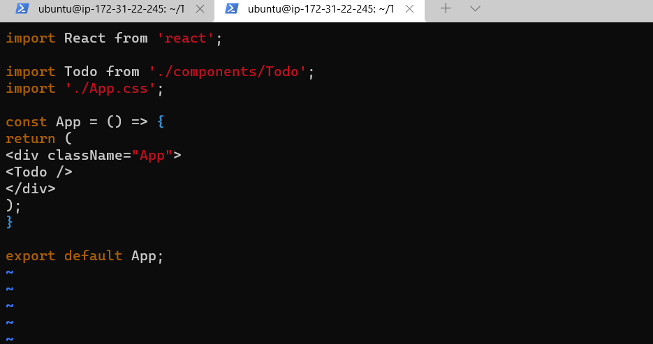

# Project 3
## Title: MERN STACK IMPLEMENTATION IN AWS CLOUD
### TASK: 
Deploy a simple TO_DO Application that creates a TO_DO list


MERN -MONGODB + EXPRESSJS + REACTJS + NODE.JS

* MongoDB: This is a document based, No-SQL database used to store application data in a form of documents.
* ExpressJS: A server-side Web Application framework for node.js.
* ReactJS: A frontend framework developed by facebook. it is based on Javascript, used to build User Interface (UI) components.
* Node.js: A JavaScript runtime environment. It is used to run Javascript on a machine rather than in a browser.


### Implementation Steps:
* Step 1 - Backend configuration
* Step 2 - Frontend Creation
 
 <!-- Horizontal Rule -->
----------------------------------------------------

1. STEP ONE: backend configuration
<!-- Code Blocks -->
```bash
$ sudo apt update
```
Updating package repository


<!-- Code Blocks -->
```bash
$ sudo apt upgrade
```
Upgrading package repository


<!-- Code Blocks -->
```bash
$ curl -sL https://deb.nodesource.com/setup_12.x | sudo -E bash -
```
Getting location of Node.js from ubuntu repository


<!-- Code Blocks -->
```bash
$ sudo apt-get install -y nodejs
```
Installing node.js 


<!-- Code Blocks -->
```bash
$ node -v
$ npm -v
```
Verifying node installation 


<!-- Code Blocks -->
```bash
$ mkdir Todo
```
Creating directory for To-Do project


<!-- Code Blocks -->
```bash
$ cd Todo
$ npm init
$ ls
```
Initializing To-Do project


<!-- Code Blocks -->
```bash
$ npm install express
```
Installing ExpressJS


<!-- Code Blocks -->
```bash
$ touch index.js
$ ls
```
Creating file index.js


<!-- Code Blocks -->
```bash
$ npm install dotenv
```
Installing dotenv module


<!-- Code Blocks -->
```bash
$ sudo vim index.js
```
Editing index.js file


<!-- Code Blocks -->
```bash
$ node index.js
```
Starting server


Verifying Server is running via URL


<!-- Horizontal Rule -->
----------------------------------------------------

TO-DO Application need to carry out the following actions.

1. Create a new task using "POST" HTTP request method.

2. Display list of all tasks using "GET" HTTP request method

3. Delete a completed task using "DELETE" HTTP request method.

<!-- Code Blocks -->
```bash
$ mkdir routes 
```
Creating routes directory to be used for creating routes for each task that will define various endpoints that the To-do application will depend on


<!-- Code Blocks -->
```bash
$ touch api.js
$ sudo vim api.js
```
Creating and Editing api.js file


<!-- Horizontal Rule -->
----------------------------------------------------

<!-- Code Blocks -->
```bash
$ npm install mongoose
```
Installing mongoose, which is a node.js package


<!-- Code Blocks -->
```bash
$ mkdir models && cd models && touch todo.js
```
Creating models directory and todo.js file


<!-- Code Blocks -->
```bash
$ mkdir models && cd models && touch todo.js
```
Updating api.js file in routes directory to make use of new model


<!-- Horizontal Rule -->
----------------------------------------------------

<!-- Code Blocks -->
```bash
$ touch .env
$ vim .env
```

Updating .env file with database information


<!-- Code Blocks -->
```bash
$ touch .env
$ vim .env
```
Updating index.js file for Node.js to be able to connect to database


<!-- Code Blocks -->
```bash
$ node index.js
```
Starting server to verify database connected successfully


<!-- Horizontal Rule -->
----------------------------------------------------

Testing Backend Code without frontend using Restful API


Testing Backend Code on MongoDB


<!-- Horizontal Rule -->
----------------------------------------------------

1. STEP TWO: Frontend creation
<!-- Code Blocks -->
```bash
$ sudo npm cache clean -f
$ sudo npm install -g n
$ sudo n stable
$ sudo n latest
```
Updating node.js to latest version


<!-- Code Blocks -->
```bash
$  npx create-react-app client
```
Creating a new folder called client to add all react code


<!-- Code Blocks -->
```bash
$  npm install concurrently --save-dev
```
Installing concurrently to run more than one command simultaneously from the same terminal window


<!-- Code Blocks -->
```bash
$  npm install nodemon --save-dev
```
Installing nodemon to run and monitor the server, restarting the server automatically and loading new changes when required


<!-- Code Blocks -->
```bash
$  npm install nodemon --save-dev
```
Before editing package.json file


After editing package.json file


<!-- Code Blocks -->
```bash
$ cd client
$ vi package.json
```
Configuring proxy in package.json by adding "proxy": "http://localhost:5000"


<!-- Code Blocks -->
```bash
$ npm run dev
```
Opening and starting app


verifying from web browser at http://3.95.241.241:3000


<!-- Horizontal Rule -->
----------------------------------------------------

<!-- Code Blocks -->
```bash
$ cd client
$ cd src
$ mkdir components
```
Creating components directory


<!-- Code Blocks -->
```bash
$ cd components
$ touch Input.js ListTodo.js Todo.js
```
Creating three files under components directory


<!-- Code Blocks -->
```bash
$ vim Input.js
```
Editing Input.js 


<!-- Code Blocks -->
```bash
$ cd client
$ touch Input.js ListTodo.js Todo.js
```
Creating three files under components directory


<!-- Code Blocks -->
```bash
$ cd client
$ sudo npm install axios
```
Installing axios


<!-- Code Blocks -->
```bash
$ cd src/components
$ vim ListTodo.js
```
Editing ListTodo.js file


<!-- Code Blocks -->
```bash
$ cd src
$ vim App.js
```
Editing App.js file


<!-- Code Blocks -->
```bash
$ cd src
$ vim App.cs
```
Editing App.cs file


<!-- Code Blocks -->
```bash
$ cd src
$ vim index.css
```
Editing index.css file


<!-- Code Blocks -->
```bash
$ cd Todo
$ npm run dev
```
Testing Todo App


